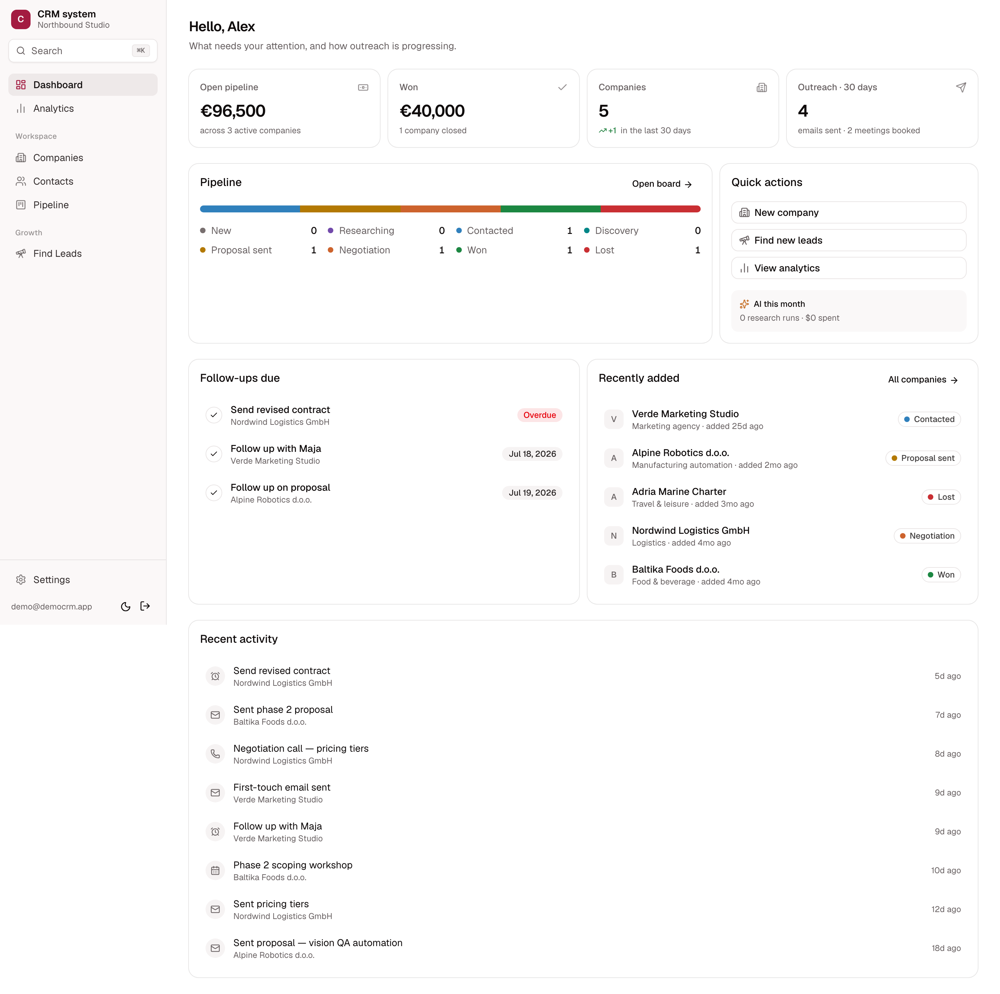
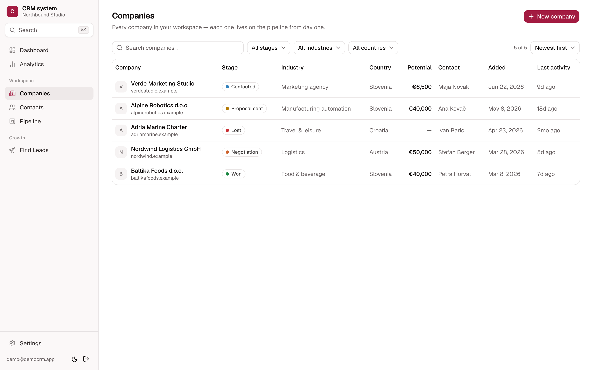
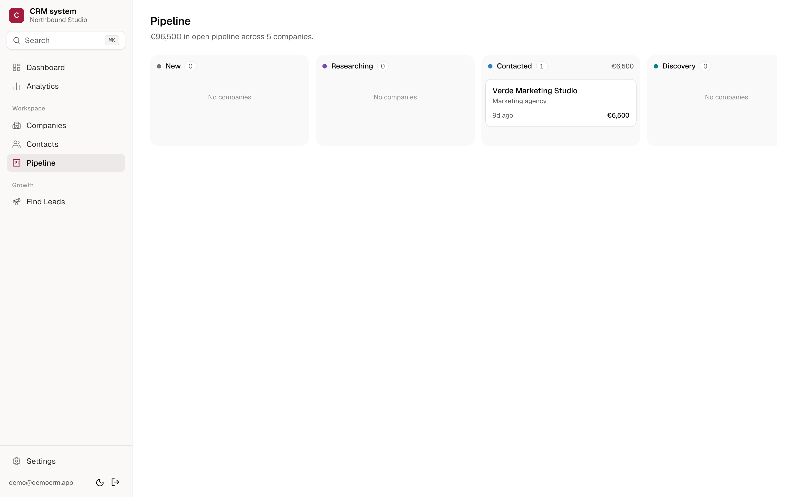
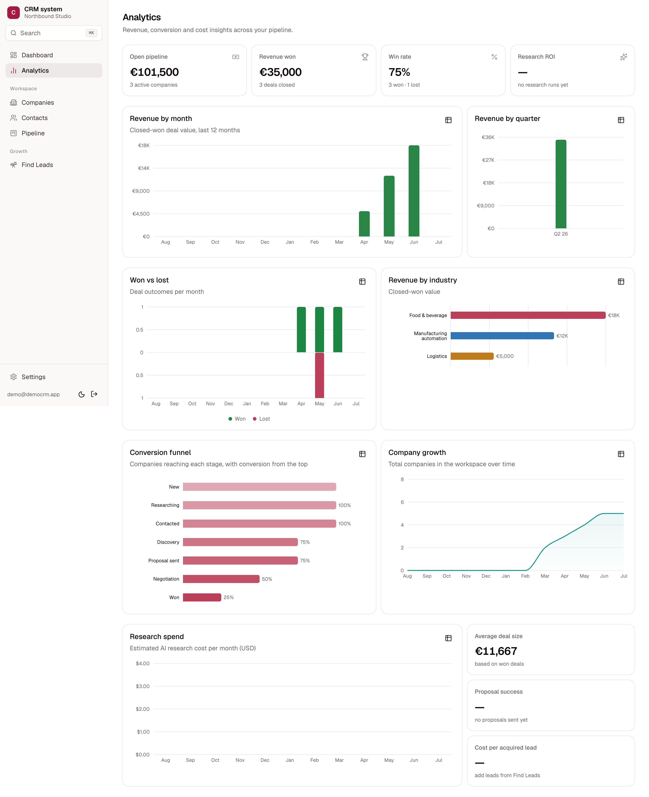
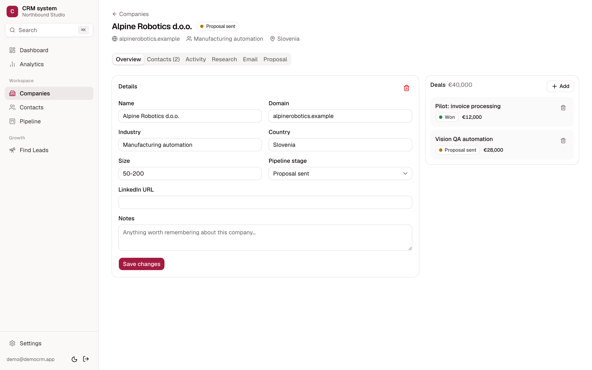
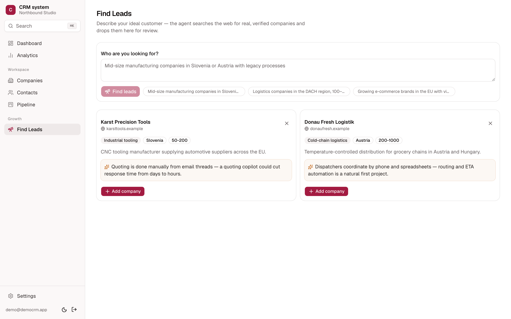
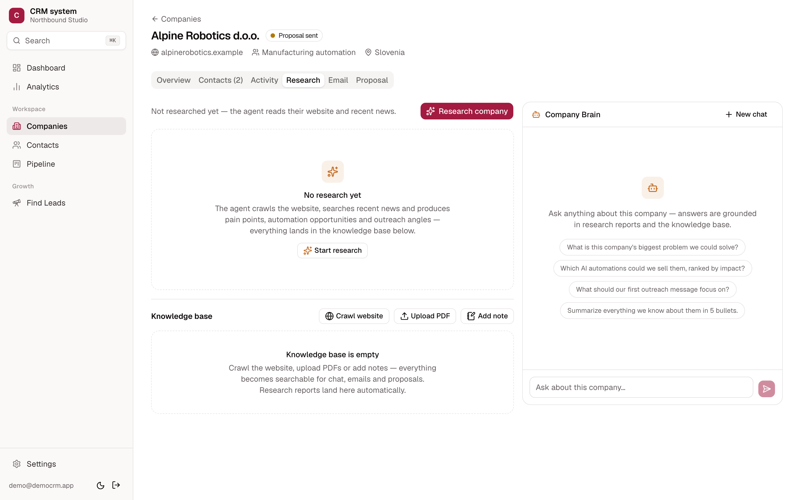
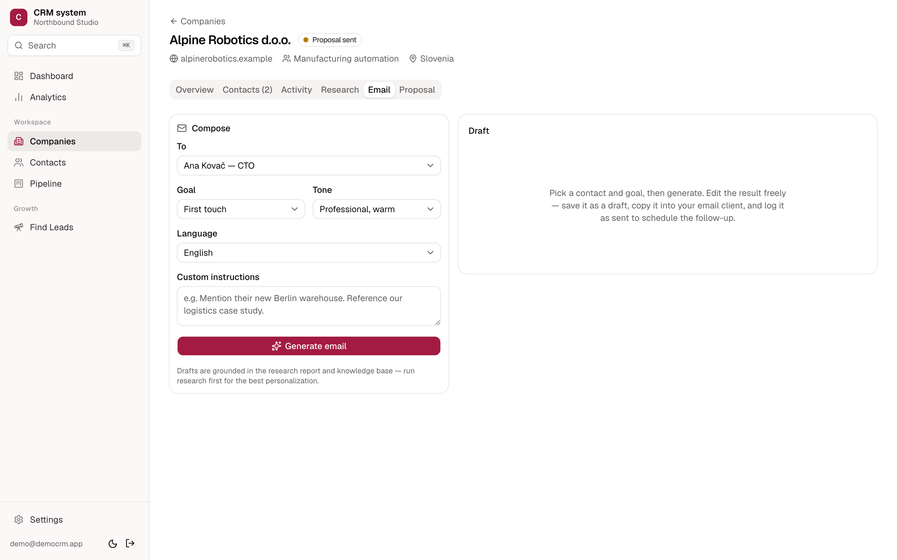
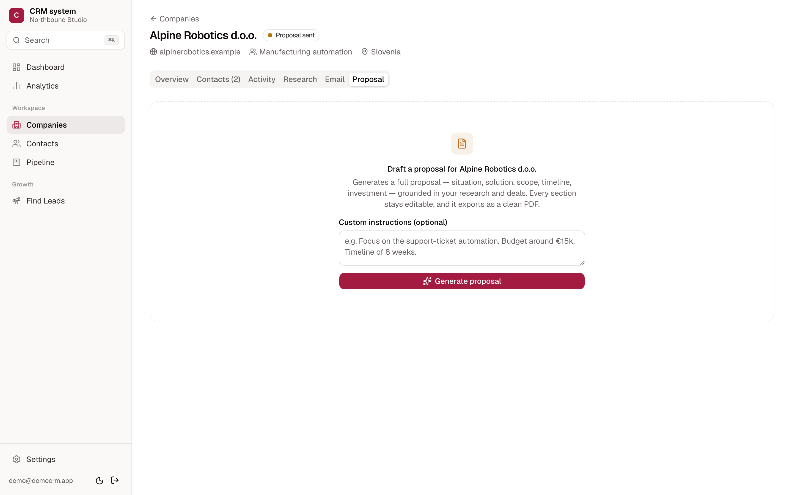

# Northbound CRM — an AI-native CRM I built for my own agency

I built this project as the CRM system for my own future company — a sales
platform for a small AI agency that doesn't just *track* clients, but actively
helps **find** them, **research** them, **write to** them, and **pitch** them.
It pairs a clean, fast CRM core with a compound AI loop, so the pipeline and the
intelligence live in one place.

This repository is a **live demo**. The CRM core is fully functional, and the
four advanced AI features are built and run live once you add your own Anthropic
API key (more on that below). I'm continuing to build and optimize it because
I'll be using it for my own business.

---

## 🔗 Live demo

**[→ Open the live demo](https://YOUR-VERCEL-URL.vercel.app)**  ·  sign in with the shared demo account:

| | |
|---|---|
| **Email** | `demo@democrm.app` |
| **Password** | `DemoCRM2026!` |

The demo workspace comes pre-loaded with example companies, contacts, deals,
pipeline stages, and activity history, so you can explore everything immediately.
It's a shared sandbox — feel free to click around. (Demo data can be reloaded any
time from **Settings → Demo data**.)

---

## ✨ What it does

### The CRM core — fully working

- **Companies & contacts** — a clean database of every company and person you're working with.
- **Company-centric pipeline** — a drag-and-drop kanban board where every company moves through stages (New → Researching → Contacted → Discovery → Proposal → Negotiation → Won / Lost).
- **Deals & revenue** — revenue objects hang off each company; the board and dashboard roll up open pipeline and won revenue automatically.
- **Activity timeline** — calls, emails, meetings, notes and follow-up tasks per company.
- **Analytics** — revenue by month/quarter/industry, win rate, conversion funnel, company growth, and research-cost/ROI insights.
- **Dashboard** — what needs your attention today, plus outreach and pipeline at a glance.
- **⌘K command palette**, **dark mode**, and per-workspace preferences (currency, email language, follow-up timing).

### The four advanced AI features — what makes it *AI-native*

These are built and functional; they call Claude and run live with your own key.

1. **Lead discovery & generation** — describe your ideal customer and the agent
   goes and finds real, matching companies on the web, explains *why* each is a
   fit, de-duplicates against your existing pipeline, and lets you add the good
   ones as companies in one click.

2. **Company research agent + RAG "Company Brain" chatbot** — a research agent
   (Claude Opus 4.8 with live web search, page fetching and site crawling)
   produces a structured intelligence report on any company. That report is
   ingested into a per-company knowledge base (vector + full-text hybrid search),
   which then grounds a **chatbot you can ask anything about that company** —
   answers are drawn from what was actually researched, not guesses.

3. **Custom email generator** — writes outreach emails grounded in that company's
   research and your relationship history, in your chosen tone, goal and language.
   Drafts are saved, editable, and regenerable, and sending logs an activity and
   schedules a follow-up.

4. **Custom PDF proposal generator** — generates a tailored, sectioned proposal
   for a company, editable inline, and exports to a clean PDF ready to send.

Together these form a loop: **research feeds the knowledge base → the knowledge
base grounds the chat, the emails, and the proposals.**

---

## 📸 Screenshots

> The CRM core below is captured from the real running app on the demo data.
> The four AI features are captured from their live interfaces in the app.

### Dashboard


### Companies


### Pipeline (kanban)


### Analytics


### Company detail


### AI · Lead discovery


### AI · Research agent + Company Brain chat


### AI · Email generator


### AI · Proposal generator


---

## 🔑 Trying the AI features (add your own Anthropic key)

The CRM core works out of the box on the demo. The four AI features call Claude,
so to run them **live** you add your own API key — this keeps the shared demo
free to run and lets you test and further optimize the AI on your own account:

1. Copy `.env.example` to `.env.local`.
2. Add your `ANTHROPIC_API_KEY` (and optionally `OPENAI_API_KEY` for embeddings
   and `FIRECRAWL_API_KEY` for website crawling).
3. Run the app locally (below) and use Research, Chat, Email, Proposal, and Find
   Leads on any company.

> On a Vercel Hobby plan, the long-running research/lead-discovery routes are
> time-limited; run those locally or on a Pro plan for the full experience.

---

## 🧱 Tech stack

- **Next.js 16** (App Router, React Server Components, Server Actions) + **React 19** + **TypeScript**
- **Tailwind CSS v4** + **shadcn/ui** (Base UI variant), OKLCH design tokens, `next-themes`
- **Supabase** — Postgres, Row-Level Security multi-tenancy, **pgvector**, Auth, Storage
- **Anthropic Claude** — Opus 4.8 (research, chat, email, proposals) + Haiku 4.5 (utility)
- **OpenAI** embeddings + **Firecrawl** crawling for the retrieval layer
- **Recharts** for analytics, colorblind-validated chart palettes
- Deployed on **Vercel**

Multi-tenancy is enforced in Postgres (RLS keyed on workspace membership), not in
app code — every workspace's data is fully isolated.

---

## 💻 Running locally

```bash
git clone https://github.com/gabercmatej/CRM-sytem.git
cd CRM-sytem
npm install
cp .env.example .env.local   # then fill in your keys
npm run dev                  # http://localhost:3000
```

You'll need a Supabase project (run the SQL in `supabase/migrations/` in order),
plus the API keys in `.env.example`. Full setup notes are in [`SETUP.md`](SETUP.md).

```bash
npm run dev        # dev server
npx tsc --noEmit   # typecheck
npm run build      # production build
npm run lint       # eslint
```

---

## 🗺️ Status & roadmap

This is a demo of a product I'm actively building for real use. The CRM core is
solid; the AI features are built and functional and are what I'm now refining —
tightening prompts, retrieval quality, and cost as I put real budget behind them.
Planned next: richer research grounding, email sequences, and proposal templates.

---

*Built by Matej Gaberc.*
